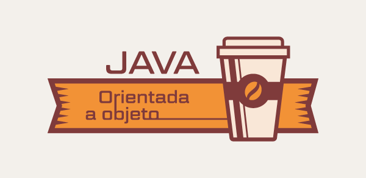

# Curso de Java POO 

<h1 align="center">
    
</h1>

## Curso  de Programação Orientada a Objetos (POO) com a linguagem Java

Representam o conjunto de aulas ministradas durante a epoca da pandemia do Covid-19 de 2019 a 2020.
Todas as aulas foram gravadas e estão disponivel na pagina do  [facebook do Itel](https://www.facebook.com/institutodetelecomunicacoes.Itel).

sendo que cada aula foi e sera uma continuadade de conteudos sobre java (com Poo e Swing), usando interfaces, visuais ou simplesmente formularios
 

  

## Conteudos apresentados e seus respectivos exercicios:

-- Introduçao a POO , Conceito de Objecto e Classe |  [VEJA AQUI](https://www.facebook.com/1645664532185143/videos/706206476793573/). | Aula 1

-- Estrutura de Um Programa em JAVA, E APLICAÇÃO DE POO |  [VEJA AQUI](https://www.facebook.com/1645664532185143/videos/251327122598394/). | Aula 2

-- CLASSES, ATRIBUTOS , METODOS, CONSTRUTOR E INSTANCIA  |  [VEJA AQUI](https://www.facebook.com/1645664532185143/videos/302497620775111/). | Aula 3

-- Relação Entre Classes (RELAÇÃO É UM HERANÇA - DIRECTA ) |  [VEJA AQUI](https://www.facebook.com/1645664532185143/videos/951134562025185/). | Aula 4
